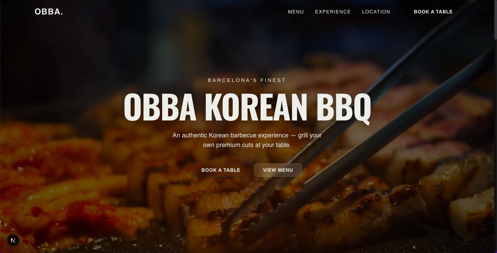

# Obba Korean BBQ — Restaurant Website

    

Live: https://obba-korean-bbq.vercel.app/



## Project overview and purpose

Obba Korean BBQ is a production-ready, marketing-focused website for a premium Korean barbecue restaurant. It demonstrates a pragmatic approach to building high-quality restaurant sites: fast, accessible, SEO-friendly, and easy to maintain. The app focuses on conversion (reservations), clarity (menu & location), and trust (testimonials and polished UI).

## Tech stack (and why)

- Next.js (App Router, v16): server rendering, hybrid rendering, and first-class Vercel deployment flow — chosen for performance and DX.
- React 19 + TypeScript: type-safety and modern React features for maintainability and refactoring confidence.
- Tailwind CSS v4: utility-first styling for rapid, consistent UI composition and design-system friendliness.
- Radix UI primitives: accessible, unstyled components (dialogs, sheets, tooltips) for robust UX without design constraints.
- Framer Motion: declarative, smooth animations that enhance perceived quality without heavy bundle penalties.
- Lucide icons: lightweight, consistent iconography.
- date-fns & react-datepicker: simple, reliable date handling for the booking flow.
- Sonner and @tanstack/react-query (present in deps): small UX-focused libraries for toasts and async data in future features.

These technologies balance developer productivity, accessibility, and runtime performance for a small-to-medium web product.

## Key features

- Landing hero with media-rich presentation and animated micro-interactions.
- Responsive navigation with an accessible mobile sheet and stable hydration handling.
- Localized content ready (I18n files in `app/locales/`).
- Menu & dishes components powered by clean data objects for easy updates.
- Booking UI (date/time/party size) with validation and UX-friendly controls.
- Testimonials and visual sections optimized for conversions.

## Architecture decisions worth noting

- App Router (Next.js) — chosen to leverage server components for fast TTFB and selective client hydration where interactivity is required.
- Server-first styling and assets — pages are server-rendered with Tailwind for predictable CSS and small client bundles.
- Stable DOM ids for interactive primitives — to avoid React hydration mismatches we prefer deterministic ids (see `Navbar` fix for `aria-controls` / `id`).
- API surface: lightweight server routes are preferred for secrets (e.g., any future Google Places proxy) and for caching responses at the edge.
- Progressive enhancement: core content renders on the server; client-only libraries (animations, toasts) are gated behind client components.

## How to run locally

1. Install dependencies:

```bash
npm install
```

2. Run development server:

```bash
npm run dev
```

Open http://localhost:3000. The project uses the Next.js app router — changes to `app/` are picked up automatically.

## Future roadmap

- Integrate a server-side proxy for Google Places reviews (cached) to surface live social proof.
- Add automated tests (component unit tests + end-to-end smoke tests) and CI checks.
- Extraction of a minimal content CMS (Markdown/Headless) for non-technical editing of menu and testimonials.
- Analytics and conversion tracking (privacy-conscious, server-side events).
- Accessibility audit and fixes to reach WCAG AA/AAA where practical.

## Where to look in the code

- Primary UI: `app/components/` (Hero, Navbar, BookingSection, MenuSection, Testimonials)
- Localization: `app/locales/` (en.json, es.json)
- App entry and pages: `app/` (App Router, layouts)
- Tailwind config: `tailwind.config.js`
- Next.js config: `next.config.ts` (image remote patterns)

---

## Contributing

Contributions are welcome. To propose a feature or report a bug, please open an issue with a clear title and reproduction steps. For code changes, follow this process:

- Fork the repository and create a feature branch from `main`.
- Open a pull request with a descriptive title and link to any related issue.
- Ensure code follows the existing style (TypeScript, Tailwind, Prettier) and run `npm run lint` locally.
- Include tests for new behavior where practical and keep changes focused.

If you'd like to discuss a large change, open an issue first to align on scope and approach. See `CONTRIBUTING.md` for more detail if present.

# Obba Korean BBQ – Restaurant Website

A modern, visually rich, and fully responsive restaurant website for Obba Korean BBQ, built with Next.js, React, and Tailwind CSS. This project demonstrates advanced UI/UX, accessibility, and real-world business logic for a premium dining experience.

## Features

- **Hero Section with Video Background:** Immersive landing experience with a high-quality looping video and animated text.
- **Dynamic Menu & Main Dishes:** Interactive, visually appealing menu with concise dish descriptions and hover effects.
- **Booking System:** Custom reservation form with date picker, guest and time selection, and validation.
- **Location & Hours:** Responsive map integration and a clear, modern weekly hours grid.
- **Testimonials:** Customer reviews carousel for social proof.
- **Internationalization Ready:** Locale support for future multi-language expansion.
- **Mobile-First & Accessible:** Fully responsive, keyboard navigable, and accessible color contrast.
- **Modern UI Components:** Built with Tailwind CSS, Framer Motion, Lucide icons, and Radix UI primitives.
- **SEO & Performance:** Optimized for fast load times and search engine visibility.

## Tech Stack

- [Next.js 16](https://nextjs.org/) (App Router)
- [React 19](https://react.dev/)
- [Tailwind CSS 4](https://tailwindcss.com/)
- [Framer Motion](https://www.framer.com/motion/) (animations)
- [Lucide React](https://lucide.dev/) (icons)
- [Radix UI](https://www.radix-ui.com/) (accessible UI primitives)
- [react-datepicker](https://reactdatepicker.com/) (date picker)
- [date-fns](https://date-fns.org/) (date utilities)
- [TypeScript](https://www.typescriptlang.org/)

## Getting Started

1. **Install dependencies:**

   ```bash
   npm install
   ```

2. **Run the development server:**

   ```bash
   npm run dev
   ```

3. **Open your browser:**
   Visit [http://localhost:3000](http://localhost:3000) to view the site.

## Project Structure

- `app/components/` – All UI components (Hero, BookingSection, MenuSection, etc.)
- `app/lib/` – Utility and i18n logic
- `public/` – Static assets (images, video)
- `app/hooks/` – Custom React hooks
- `app/locales/` – Localization files

## Customization

- **Menu & Dishes:** Edit `app/components/MainDishes.tsx` and `MenuSection.tsx`.
- **Opening Hours:** Edit `app/components/LocationSection.tsx`.
- **Testimonials:** Edit `app/components/Testimonials.tsx`.
- **Branding & Content:** Update images and video in `public/`.

## Deployment

Deploy easily to [Vercel](https://vercel.com/) or any platform supporting Next.js.

---

This project is a showcase of modern React/Next.js development, advanced UI, and real-world business logic.  
Built and maintained by [Graeme Byrne](https://graemebyrne.com).

---
